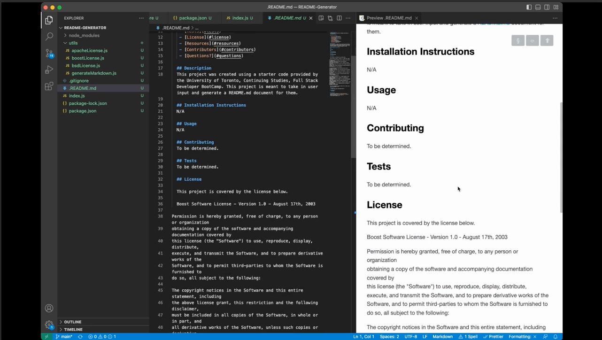

  # README Generator 
  

  ## Table of Contents

   - [Description](#description)
   - [Demo](#demo)
   - [Installation](#installation)
   - [Usage](#usage)
   - [Contributing](#contributing)
   - [Tests](#tests)
   - [License](#license)
   - [Resources](#resources)
   - [Contributors](#contributors)
   - [Questions?](#questions)

  ## Description
  This project was created using a starter code provided by the University of Toronto, Continuing Studies, Full Stack Developer BootCamp. This project is meant to take in user input and generate a README.md document for them.

  - Demo
  
    https://drive.google.com/file/d/1lQ0bqvfAZleqwsHJtrrqvoQoDPC4c9_x/view

  ## Installation Instructions
  N/A

  ## Usage
  N/A

  ## Contributing
  To be determined.

  ## Tests
  To be determined.

  ## License
  
  This project is covered by the license below.

  Boost Software License - Version 1.0 - August 17th, 2003

Permission is hereby granted, free of charge, to any person or organization
obtaining a copy of the software and accompanying documentation covered by
this license (the "Software") to use, reproduce, display, distribute,
execute, and transmit the Software, and to prepare derivative works of the
Software, and to permit third-parties to whom the Software is furnished to
do so, all subject to the following:

The copyright notices in the Software and this entire statement, including
the above license grant, this restriction and the following disclaimer,
must be included in all copies of the Software, in whole or in part, and
all derivative works of the Software, unless such copies or derivative
works are solely in the form of machine-executable object code generated by
a source language processor.

THE SOFTWARE IS PROVIDED "AS IS", WITHOUT WARRANTY OF ANY KIND, EXPRESS OR
IMPLIED, INCLUDING BUT NOT LIMITED TO THE WARRANTIES OF MERCHANTABILITY,
FITNESS FOR A PARTICULAR PURPOSE, TITLE AND NON-INFRINGEMENT. IN NO EVENT
SHALL THE COPYRIGHT HOLDERS OR ANYONE DISTRIBUTING THE SOFTWARE BE LIABLE
FOR ANY DAMAGES OR OTHER LIABILITY, WHETHER IN CONTRACT, TORT OR OTHERWISE,
ARISING FROM, OUT OF OR IN CONNECTION WITH THE SOFTWARE OR THE USE OR OTHER
DEALINGS IN THE SOFTWARE.

  For more information on this license go to: (https://www.boost.org/LICENSE_1_0.txt)

  ## Resources
  1. Starter Code: https://www.npmjs.com/package/inquirer
  2. Reference for Licenses: https://choosealicense.com/
  3. Markdown Reference: https://www.markdownguide.org/cheat-sheet/

  ## Contributors
  1. caballero-r
  2. Xandromus
  3. gachoi06

  ## Questions?
  If you have any questions or concerns about this application please reach out to [caballero-r](https://github.com/caballero-r) or via email to russellncaballero@gmail.com.
 
